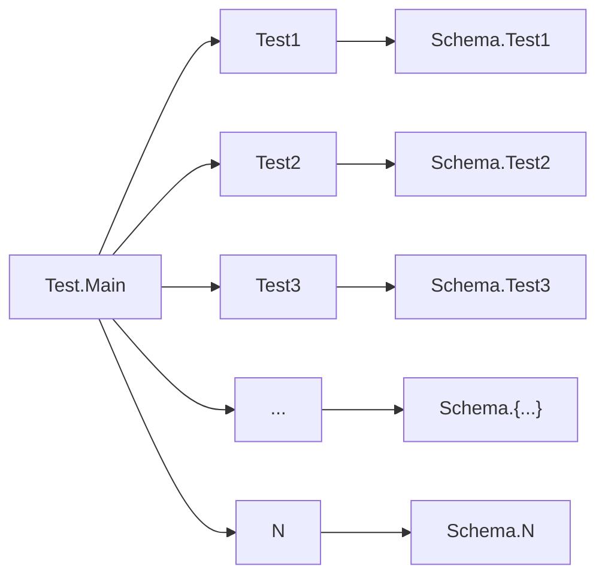
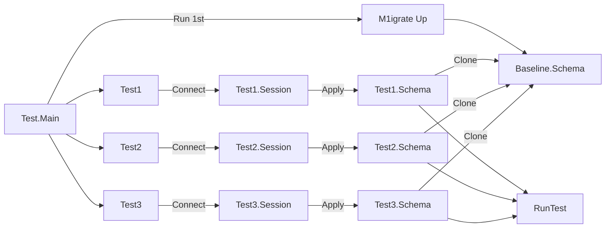

# Postgres

The postgres package provides a `compatibility` layer between `lib/pq` and `jackq/pgx`.

The motivation of bridging `lib/pq` and `jackq/pgx` is because we are using `lib/pq` at the begining of our project. While migrating to `pgx` we found many things are not compatible with `database/sql`. To make things consistent on our end we build the `compatibility` layer.

This package provide some helper functions taken and modified from https://github.com/golang/pkgsite/tree/master/internal/database.

## Disclaimer

This package doesn't guarantee full backwards compatibility between `stdlib` and `jackq/pgx` because `gpx` use a lot of custom error inside the package itself. For example, `sql.ErrNoRows` is `pgx.ErrNoRows` in `pgx`. We tried to convert this back in some cases, but not all.

## Testing

The package provide several helper functions with the aim to make testing easier. We use `testing.Testing()` to protect the helper function to be used outside of `*_test.go`.

1. Create Database.

    User is allowed to create a new database via `CreateDatabase` function. The function will `forcefully` creates the database, which means it will be `drop` the existing database and create a new one if needed.

1. Drop Database.

    User is allowed to drop a database is it no-longer used.

1. Apply Schema.

1. ForkConnWithNewSchema.

### Parallel Testing With Multiple Schemas

The package allows the user to perform parallel testing to a single Postgres database by separating [Postgresql Schema](https://www.postgresql.org/docs/current/ddl-schemas.html) for each connection/session.

**One Session One Schema**

When doing integration tests for a program, the program/test need to be run sequentially. If not, then there will a high chance of data-race and failing tests all over the place because they are relying on one data source and schema. This is why,
it's very important to make the data to be separated per test cases to recuce the chance of data race and flaky tests.

But, separating the data is sometimes not enough, because multiple tests cases might need to see the data in the same table but with different condition or flag. This bring us back to the first problem, tests need to be run in sequential order.

While running tests in sequential order solves the problem and good enough for small to medium sized codebase, this can be very slow for a large codebase where we have thousands of integration tests touching the database. To speed-up this process,
the tests need to be running in parallel and in a different schema for different tests cases.

**How Schema Cloning Maintained?**

When doing migration, we will always keeping the `baseline` called `baseline.schema`. This will ensure the whole structure will never changed and we don't need to wait for any locks(other than schema clone) to clone the whole schema to another schema.

