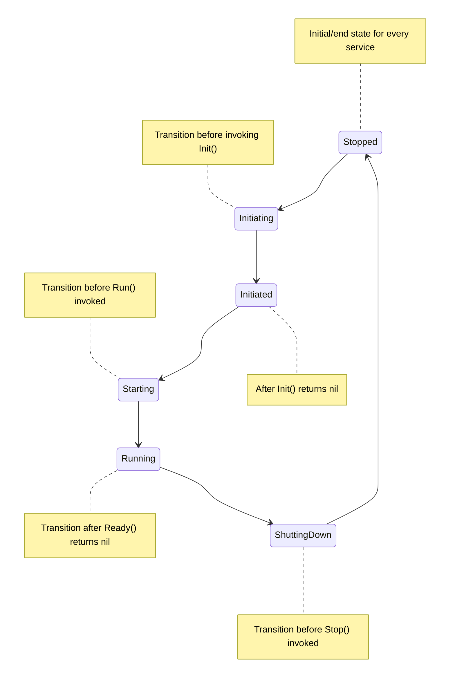
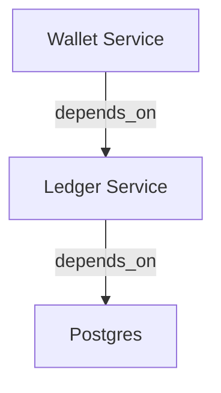

# Service Runner

Service runner is a helper and steroid for `func main()` so the program can correctly listen to all `exit` signals and enable auto-upgrade via `SIGHUP(1/HUP)` via [tableflip](https://github.com/cloudflare/tableflip).

This package provides an `interface` for the `client`/`service` to implement so `runner` can track and control their `state` when needed. The goal of this package is to control the `state` of `service` correctly and not leaving any `resources` behind.

## Requirements

This package require Go 1.22+ as we use the new `http.ServeMux` to serve the admin server.

## Example

You can look into the example [here](./example/main.go).

## Features

1. Graceful Shutdown

   The service runner let a program to be shutdown gracefuly and give some mechanism for the user to wait until all requests are being taken care by the program before shutdown.

   While the runner helps to ensure the program to exit gracefully, the user still need to be aware of what resource/service that runner will close first. To understand more about this, please read more on how to use the runner.

1. Help To Properly Close/Release All Resources

   When we create a Go program, for example a web service, we usually opens a lot of connections and resources to interact with databases and other services or protocols. But, sometimes all these resources are not being properly closed/released when the program stops. This can cause some problems as sometimes it leaves some resource to be leaked.

   Runner wants to help the user to solve this problem by properly releasing all resources when program stops.

1. Self Upgrade

   Runner allow program to self-upgrade via `SIGHUP(1)`. This allow us to deploy Go binary to virtual machine while allowed the program to be easily upgraded. Sometimes we don't need container for all usecases and just want a simple deployment mechanism. You can always disable the upgrader when you don't need this feature.

1. Healthcheck

   The package provides `active` and `passive` healthcheck. Please read more about this feature [here](##Healthcheck).

1. Admin Server

   Service runner package opens an `admin` port by default. The `admin` HTTP server serves multiple endpoints for:

   - Exposing `/metrics` for Prometheus metrics.
   - Exposing `/health` for health-checks. This endpoint can be used by platform like `Kubernetes` or `Consul` to check whether the application is up and running.
   - Exposing `/ready` for ready-checks. Some platform like `Kubernetes` usually use this endpoint to check whether they can start delivering traffic to the service or not.
   - Exposing `/debug/**` for profiling.

1. Pre-defined Flags

   Runner adds some pre-defined flags for the user so the user doesn't have to add the same flags manually in their program. The flags are:

   1. Config[`config`]

      The `--config` flag is a `string` flag that will be used to define configuration path for the program.

      For example:

      ```bash
      ./program --config=some_config.yaml
      ```

   2. Feature Flags[`feature.eanble`]

      The `--feature.enable` flag is a `[]string` flag that will be used to define the feature that enabled by the program.

      For example:

      ```bash
      ./program --feature.enable=feature_1 --feature.enable=feature_2
      ```

      The feature flag is automatically monitored via `otel` metrics named `srun-feature-flags` using a `guage` meter.

## Environment Variables

The `srun` package provides several environment variables as a knob to easily configure the program. The package will always respect the environment variable as the highest priority, so the value of the environment variable will override the default value or the value of the configuration.

The reason of why we are doing this is because sometimes we want to enforce some standards to the program without changing the code too much.

### Logging

1. `SRUN_LOG_FORMAT`

    Set the format of the log, either `json` or `text`.

2. `SRUN_LOG_LEVEL`

    Set the level of the log, either `debug`, `info`, `warn`, or `error`.

### OpenTelemetry

1. `SRUN_OTEL_TRACE_EXPORTER`

    OTel has either `http` or `grpc` as the exporter.

2. `SRUN_OTEL_TRACE_EXPORTER_ENDPOINT`

    Set the `endpoint` of the exporter, for either `http` or `grpc`.

3. `SRUN_OTEL_TRACE_EXPORTER_ENDPOINT_INSECURE`

    Set the `insecure` flag of the exporter, for either `http` or `grpc`.

## Understanding Runner

### What Is Service?

A `service` is a resource that need to be properly managed in the long-run. This is why usually a service is in a form of long-running background job like web server.

In the code, `service` should iplement `ServiceRunnerAware` so it we can register it to the runner.

### Self Upgrade

The program can do self-upgrade via `SIGHUP(1)`, but the `service` need to understand about this. So, the service should implement `ServiceUpgradeAware` to ensure the upgrade is completed.

### The Interface

Runner provides an `interface` for the client to implement which called `ServiceRunnerAware`. If a `service` implements this `interface`, then it can be registered to the runner.

In the `interface`, there are several methods that need to be supported:

```go
type ServiceRunnerAware interface {
	Name() string
	Init(Context) error
	Run(context.Context) error
	Ready(context.Context) error
	Stop(context.Context) error
}
```

1. Name

   Name method returns the name string of the service. Runner need the service name to identify the service and put more context into its log.

2. Init

   Init receives `runner.Context` and pass it to the `service`. The `runner` pass several things inside the `Context`:

   - OpenTelemetry trace client.
   - OpenTelemetry metrics client.
   - Slog logger.

   > Runner doesn't expect Init to be blocking, it has internal timeout for Init function call.

3. Run

   Run runs the `service`. And up to the client, it can be blocking or non-blocking.

4. Ready

   Ready checks the `service` whether it is ready or not. As `runner` runs the `service` in FIFO order, it will only goes to the next `service` if the previous `service` is in the `ready` state.

   > Runner doesn't expect Ready to be blocking, it has internal timeout for Ready function call.

5. Stop

   Stop stops the `service`. The `runner` will wait for the `service` to be stopped with a timeout, and hoping within that time the `service` already stopped. This to ensure the `runner` for not waiting forever.

### Service State

There are several `service` state tracked by the runner. The `state` are:

1. Initiating

   This is when the runner is about to invoke `Init` function.

1. Initiated

   This is after the runner succesfully invoke `Init` function.

1. Starting

   This is when the runner is about to invoke `Run` function.

1. Running

   This is when runner receive `ready` callback.

1. Shutting Down

   This is when runner is about to invoke `Stop` function.

1. Stopped

   This is when the `service` is completely stopped, which means the `Stop` function already returned.



### Services Start Order

When runner start services(`ServiceRunnerAware`), it will starts all services in FIFO(First In First Out) order. For example, we have a stack looked like this:

| Service_1 (**Start First**) |
| --------- |
| Service_2 |
| Service_3 (**Start Last**) |

So, if your `gRPC` or `HTTP` server is at the bottom of the stack, it will start last. This ensures the program to be ready first before opening any connections to your application.

### Services Stop

When runner stop all services, it will stop the services from bottom using LIFO approach(Last In First Out). By using this format, and if we use the [Services Start](#services-start) example, it should looked like this:

| Service_1 (**Stopped Last**) |
| --------- |
| Service_2 |
| **Service_3** (**Stopped First**) |

If you have your `gRPC` or `HTTP` server at the bottom of the stack, it will stopped them first and ensure the program to handle all the requests. Then it will close all other resources.

### Default Services

Service runner provides several default services to help the user running a Go program. The default services aimed to help the user to:

1. Self-upgrade the binary.

   To self-upgrade itself, the program need to listen to `SIGHUP` signal to properly transfer all file descriptors to the child program and shutdown the parent.

1. Start open-telemetry trace and metrics provider.

   We want tracing and metrics collection to be available out of the box, and open-telemetry is an open and widely used standard.

1. Provide `pprof`, `healthcheck`, and `ready` endpoint by spawning an additional `HTTP` server called `admin` in a different port(configurable).

   Usually a web service/server opens a different port to serve administrational endpoints. We want to provide similar things so user can use the server to do things like profiling(via pprof) and healthcheck.

## Healthcheck

> This feature is experimental and not enabled by default.

The service runner provides healthcheck to all services so we are able to indentify all the services statuses at one time. It provides `active` and `passive` healthcheck and allows services to consumes the check notifications.

By default, the healthcheck is disabled and you must enabled it manually by enabling it in the `srun` configuration. When the healthcheck is enabled, and the service is started, it will automatically runs two long-running `goroutines` to tracks the `services` health inside `srun`.

What it means by `active` and `passive` healthcheck?

**Active**

Active healthcheck allows any service to `push` their health status so the runner and other services immediately knows the health status of the service. This kind of notification will allows us to build circuit-breaker, rate-limit and doing other actions to prevent our system being hammered when it's not healthy.

**Passive**

Passive healthcheck allows the service runner to check the health status of a service periodically. By default, the runner is doing this in every thirty(30) seconds.

### Consuming Healthcheck Notification

It is possible for other services to consume healthcheck from other services. With this information, you might want to update your health status to `degraded` or `unhealthy` as you have dependencies to another services. This then allowed other services to also consumes the information and take appropriate action regarding the checks.

For example:

We have a `ledger` service that depends on `postgres` database, and a `wallet` service that depends on the `ledger` service.



So, when the `postgres` service is unhealthy for some reason, we the `ledger` service can immediately check the notification updates and set itself as `unhealthy`. And as soon as the `ledger` service is `unhealthy`, the `wallet` service can act accordingly to the `ledger` service status.

This kind of scenario is useful for the service that `depends_on` so the service can reject the impossible requests because of the `unhealthy` service.

Below is an example of a service can consume the healthcheck notification.

```go
package service

import (
	"sync"
)

type Service struct {
	mu sync.Mutex
	healthy bool
}

func (s *Service) ConsumeHealthcheckNotification(fn HealthcheckNotifyFunc) error {
	// Loop to receive the notifications and only return when we receie any errors from the function. The function will automatically issue an error if all the services are stopped and no checks notification will be done.
	err := fn([]string{"resource_manager.postgres"}, func(notif HealthcheckNotification) error {
		switch notif.ServiceName {
			case "resource_manager.postgres":
				break
		}
	})
	return err
}
```
