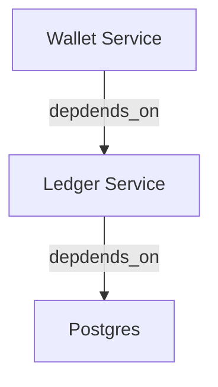

# Service Runner

Service runner is a helper and steroid for `func main()` so the program can correctly listen to all `exit` signals and enable auto-upgrade via `SIGHUP(1/HUP)` via [tableflip](https://github.com/cloudflare/tableflip).

The motivation to create the service runner coming from our usecase of running a large Go monolith on top of VM using `systemd`. Inside the applications, we have a lot of modules with some backgrund processes that we called `service`. Previously we are trying to manage all of the services one by one, and with this our code complexity bloats. After sometime we decided to create a `service operator` package on top of our services to reduce the code complexity.

By using this package, it doesn't mean you don't need to manage the state and correctness inside your own package or `service`. You still to maintain them by correctly use all the functions provided by this package. For example, to shutdown a http server you still need to call `http.Server{}.Shutdown()` inside the `Stop` method.

## Requirements

This package require Go 1.22+ as we use the new `http.ServeMux` to serve the admin server.

## Features

1. Graceful Shutdown

   The service runner ensure a program to be shutdown gracefuly and give some mechanism for the user to wait until all requests are being taken care by the program before shutdown.

   While the runner helps to ensure the program to exit gracefully, the user still need to be aware of what resource/service that runner will close first. To understand more about this, please read more on how to use the runner.

1. Properly Close/Release All Resources

   When we create a Go program, for example a web service, we usually opens a lot of connections and resources to interact with databases and other services or protocols. But, sometimes all these resources are not being properly closed/released when the program stops. This can cause some problems as sometimes it leaves some resource to be leaked.

   Runner wants to solve this problem by properly releasing all resources when program stops.

1. Self Upgrade

   Runner allow program to self-upgrade via `SIGHUP(1)`. This allow us to deploy Go binary to virtual machine while allowed the program to be easily upgraded. Sometimes we don't need container for all usecases and just want a simple deployment mechanism. You can always disable the upgrader when you don't need this feature.

1. Healthcheck

   The package provides `active` and `passive` healthcheck. Please read more about this feature [here](##Healthcheck).

1. Admin Server

   Service runner package opens an `admin` port by default. The `admin` HTTP server serves multiple endpoints for:

   - Exposing `/metrics` for Prometheus metrics.
   - Exposing `/health` for health-checking.
   - Exposing `/debug/**` for profiling.

## Understanding Runner

### What Is Service?

A `service` is a resource that need to be properly managed in the long-run. This is why usually a service is in a form of long-running background job like web server.

In the code, `service` should iplement `ServiceRunnerAware` so it we can register it to the runner.

### Self Upgrade

The program can do self-upgrade via `SIGHUP(1)`, but the `service` need to understand about this. So, the service should implement `ServiceUpgradeAware` to ensure the upgrade is completed.

### Service State

There are several `service` state tracked by the runner. The `state` are:

1. Initiating

   This is when the runner is about to invoke `Init` function.

1. Initiated

   This is after the runner succesfully invoke `Init` function.

1. Starting

   This is when the runner is about to invoke `Run` function.

1. Running

   This is when runner receive `ready` callback.

1. Shutting Down

   This is when runner is about to invoke `Stop` function.

1. Stopped

   This is when the `service` is completely stopped, which means the `Stop` function already returned.

### When Init Is Called?

The `Init` function is called when a `service` is being registered.

```go
func main() {
	runner := New(srun.Config{})
	runner.Run()
}

func run(ctx srun.Context, runner srun.ServiceRunner) error {
	runner.Register() // <- This is when init is called.
	return nil
}
```

### Services Start

When runner start services(`ServiceRunnerAware`), it will starts all services in FIFO(First In First Out) order. For example, we have a stack looked like this:

```
|---------|
|Service_1| <- This service will run first.
|---------|
|Service_2|
|---------|
|Service_3|
|---------|
```

So, if your `gRPC` or `HTTP` server is at the bottom of the stack, it will start last. This ensures the program to be ready first before opening any connections to your application.

### Services Stop

When runner stop all services, it will stop the services from bottom using LIFO approach(Last In First Out). By using this format, and if we use the [Services Start](#services-start) example, it should looked like this:

```
|---------|
|Service_1|
|---------|
|Service_2|
|---------|
|Service_3| <- This service will be stopped first.
|---------|
```

If you have your `gRPC` or `HTTP` server at the bottom of the stack, it will stopped them first and ensure the program to handle all the requests. Then it will close all other resources.

### Default Services

Service runner provides several default services to help the user running a Go program. The default services aimed to help the user to:

1. Set the `logger` configuration using `log/slog`.

   Since Go 1.21.0, Go provide an official structured logging library called `slog`. We use this to provide a standard logging for the program.

2. Self-upgrade the binary.

   To self-upgrade itself, the program need to listen to `SIGHUP` signal to properly transfer all file descriptors to the child program and shutdown the parent.

3. Start open-telemetry trace and metrics provider.

   We want tracing and metrics collection to be available out of the box, and open-telemetry is an open and widely used standard.

4. Provide `pprof` and `healthcheck` endpoint by spawning an additional `HTTP` server called `admin` in a different port(configurable).

   Usually a web service/server opens a different port to serve administrational endpoints. We want to provide similar things so user can use the server to do things like profiling(via pprof) and healthcheck.

## Healthcheck

The service runner provides healthcheck to all services so we are able to indentify all the services statuses at one time. It provides `active` and `passive` healthcheck and allows services to consumes the check notifications.

But what it means by `active` and `passive` healthcheck?

**Active**

Active healthcheck allows any service to `push` their health status so the runner and other services immediately knows the health status of the service. This kind of notification will allows us to build circuit-breaker, rate-limit and doing other actions to prevent our system being hammered when it's not healthy.

**Passive**

Passive healthcheck allows the service runner to check the health status of a service periodically. By default, the runner is doing this in every thirty(30) seconds.

### Consuming Healthcheck Notification

It is possible for other services to consume healthcheck from other services. With this information, you might want to update your health status to `degraded` or `unhealthy` as you have dependencies to another services. This then allowed other services to also consumes the information and take appropriate action regarding the checks.

For example:

We have a `ledger` service that depends on `postgres` database, and a `wallet` service that depedns on the `ledger` service.



So, when the `postgres` service is unhealthy for some reason, we the `ledger` service can immediately check the notification updates and set itself as `unhealthy`. And as soon as the `ledger` service is `unhealthy`, the `wallet` service can act accordingly to the `ledger` service status.

This kind of scenario is useful for the service that `depends_on` so the service can reject the impossible requests because of the `unhealthy` service.

Below is an example of a service can consume the healthcheck notification.

```go
package service

import (
	"sync"
)

type Service struct {
	mu sync.Mutex
	healthy bool
}

func (s *Service) ConsumeHealthcheckNotification(fn HealthcheckNotifyFunc) error {
	// Loop to receive the notifications and only return when we receie any errors from the function. The function will automatically issue an error if all the services are stopped and no checks notification will be done.
	err := fn([]string{"resource_manager.postgres"}, func(notif HealthcheckNotification) error {
		switch notif.ServiceName {
			case "resource_manager.postgres":
				break
		}
	})
	return err
}
```
