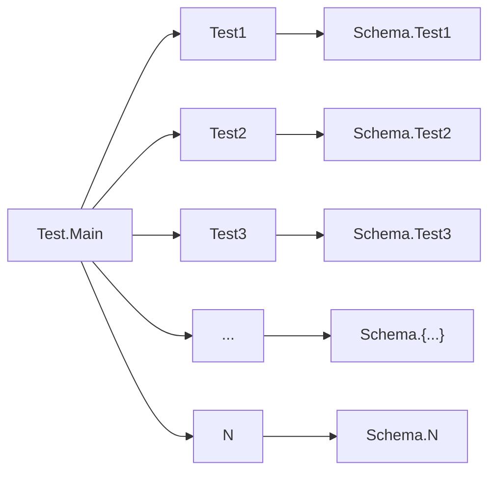
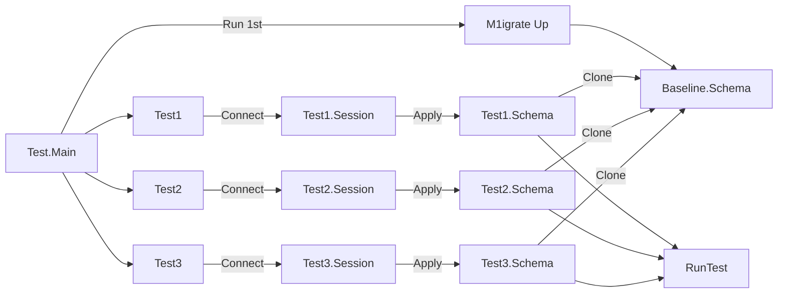

# Postgres Testing

The testing package allows the user to migrate up a migration schema and destroy them for testing purposes.

The package allows the user to perform parallel testing to a single Postgres database by separating [Postgresql Schema](https://www.postgresql.org/docs/current/ddl-schemas.html) for each connection/session.

## Notes

As this package allowed you to test your codes in parallel, you might also want to consider your PostgreSQL configuration to support this.

For example, increasing `max_connections` and `shared_buffers` might be needed to maximize your tests.

```sql
ALTER SYSTEM SET max_connections = 300
ALTER SYSTEM SET shared_buffers = '300MB'
```

To allow more connections opened for testing purposes.

## One Session One Schema

When doing integration tests for a program, the program/test need to be run sequentially. If not, then there will a high chance of data-race and failing tests all over the place because they are relying on one data source and schema. This is why,
it's very important to make the data to be separated per test cases to recuce the chance of data race and flaky tests.

But, separating the data is sometimes not enough, because multiple tests cases might need to see the data in the same table but with different condition or flag. This bring us back to the first problem, tests need to be run in sequential order.

While running tests in sequential order solves the problem and good enough for small to medium sized codebase, this can be very slow for a large codebase where we have thousands of integration tests touching the database. To speed-up this process,
the tests need to be running in parallel and in a different schema for different tests cases.



## Schema Migration & Clone

When doing migration, we will always keeping the `baseline` called `baseline.schema`. This will ensure the whole structure will never changed and we don't need to wait for any locks(other than schema clone) to clone the whole schema to another schema.


